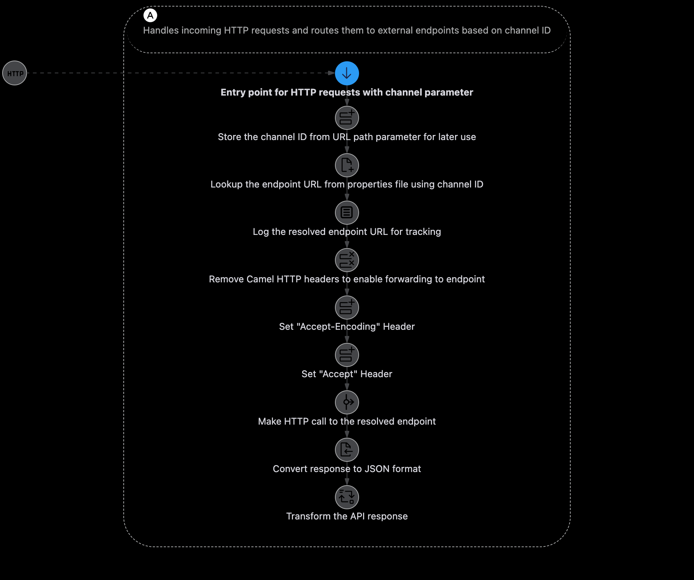

# Karavan-Camel-K8S Example

This little demo uses the different categories of the Chuck Norris API (https://api.chucknorris.io) to illustrate routing of context paths of a local API to a remote API. The local API takes a channel parameter and maps it to a known category of the remote API.

Behind the scenes the implementation uses Apache Camel (https://camel.apache.org/) and the Camel JBang (https://camel.apache.org/manual/camel-jbang.html). 

## Overview



## Prerequisits

- run `sh setup.sh` to
  - install required tools 
  - add required plugins/apps

## quick local startup

```bash
camel run *
```

After a while (due to downloading of dependencies) you can access 

```
2025-02-01 10:58:44.458  INFO 32032 --- [           main] e.camel.impl.engine.AbstractCamelContext : Apache Camel 4.9.0 (channel-router) is starting
2025-02-01 10:58:44.533  INFO 32032 --- [           main] vertx.core.spi.resolver.ResolverProvider : Using the default address resolver as the dns resolver could not be loaded
2025-02-01 10:58:44.573  INFO 32032 --- [ntloop-thread-0] tform.http.vertx.VertxPlatformHttpServer : Vert.x HttpServer started on 0.0.0.0:8080
2025-02-01 10:58:44.701  INFO 32032 --- [           main] e.camel.impl.engine.AbstractCamelContext : Routes startup (total:1)
2025-02-01 10:58:44.701  INFO 32032 --- [           main] e.camel.impl.engine.AbstractCamelContext :     Started channel-request-handler (platform-http:///channels/%7Bchannel%7D)
2025-02-01 10:58:44.701  INFO 32032 --- [           main] e.camel.impl.engine.AbstractCamelContext : Apache Camel 4.9.0 (channel-router) started in 242ms (build:0ms init:0ms start:242ms boot:16s738ms)
2025-02-01 10:58:44.701  INFO 32032 --- [           main] ponent.platform.http.main.MainHttpServer : HTTP endpoints summary
2025-02-01 10:58:44.701  INFO 32032 --- [           main] ponent.platform.http.main.MainHttpServer :     http://0.0.0.0:8080/channels/{channel}       
```

As soon as this happens, the local API is accessible underneath: http://localhost:8080/channels/{channel}

Configured channels for categories of Chuck Norris jokes are as follows:

| Channel | Category |
| ------- | -------- |
| 12345   | Movies   |
| 67890   | Food     |

## Docker

Build and run the image with Docker like this:

```bash
# Build the image
docker build -t camel-router .

# Run with environment variable
docker run -p 8080:8080 -e EXAMPLE_ENV=custom_value camel-router

# Check the health status
docker inspect --format='{{json .State.Health}}' <container_id>
```

## Docker Compose

Run the image with Docker like this:

```bash
# Create .env file from the sample
cp .env.sample .env

# Start the service
docker-compose up -d

# Check logs
docker-compose logs -f

# Stop the service
docker-compose down
```

## k8s deployment

```bash
camel kubernetes export *
```